# Team France Bleu - Webpage
This monorepo contains the backend and frontend for the [**Team France Bleu**
homepage](https://tfb.michel.lu). The page is fully responsive. User can be registered under /register.
After a successful authentication users can edit the content of the page. 

This project is still work in progress but is fully functional.

To view a live demo visit [www.tfb.michel.lu](https://www.tfb.michel.lu)

#### Frontend technologies:
- Angular
- Angular Material
- Tailwind CSS
- SASS

#### Backend technologies:
- Nestjs
- TypeORM
- REST-API
- JSON web tokens
- Cookies

## Screenshots

### Visible to everyone

  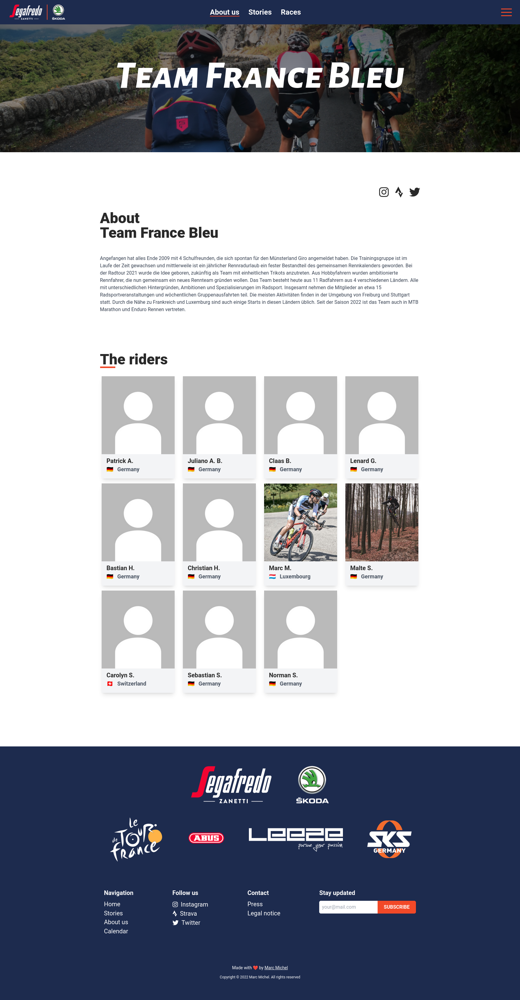
  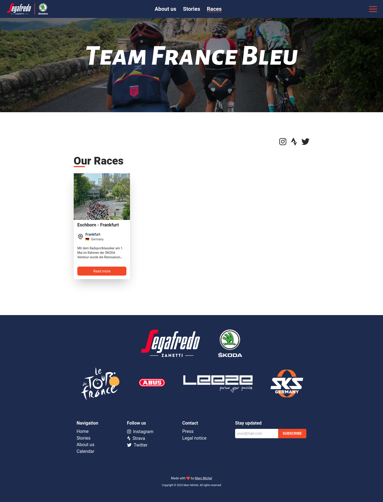 
  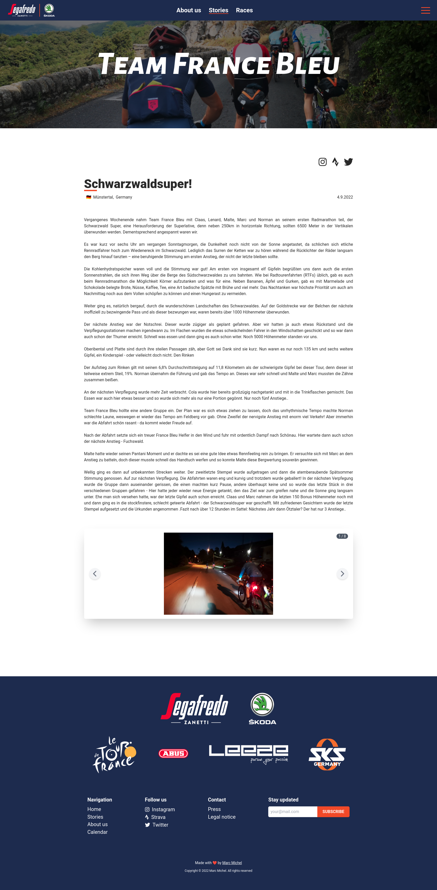

  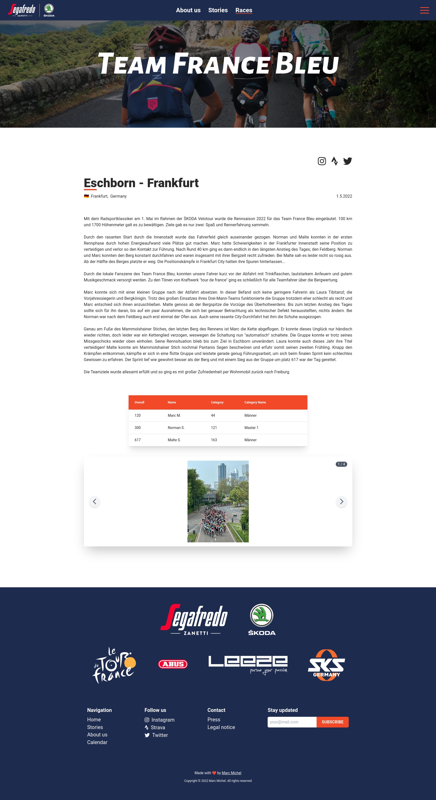
  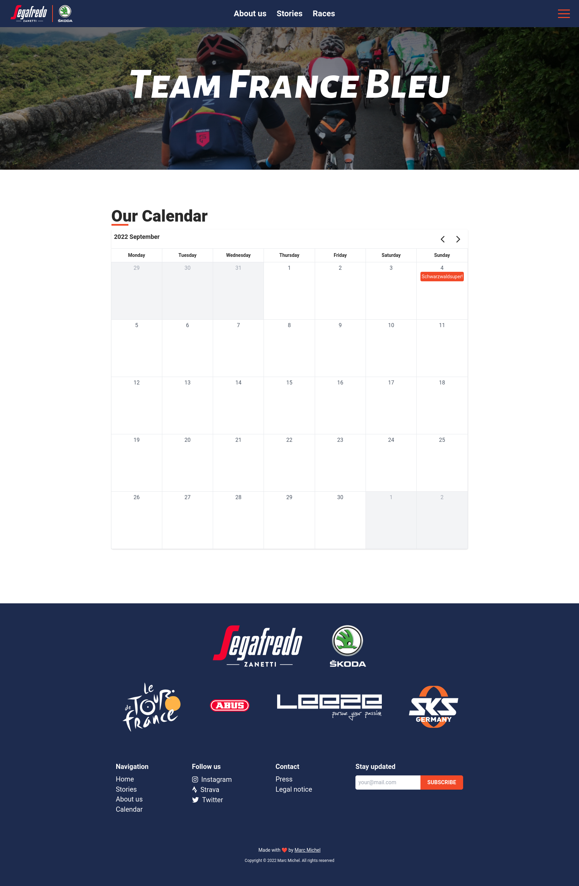 
  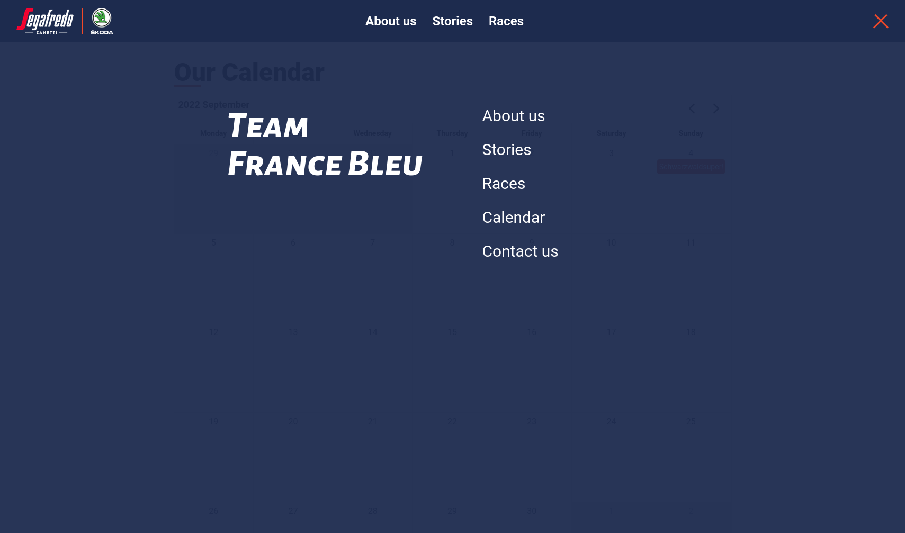

### Restricted site access
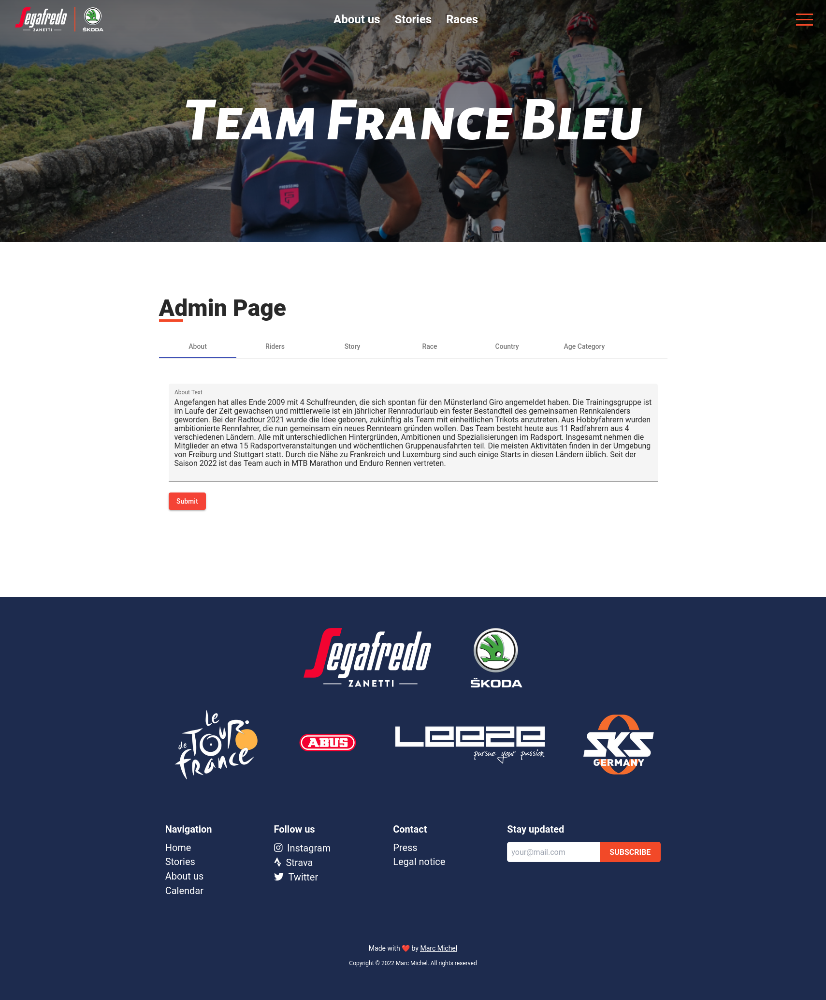
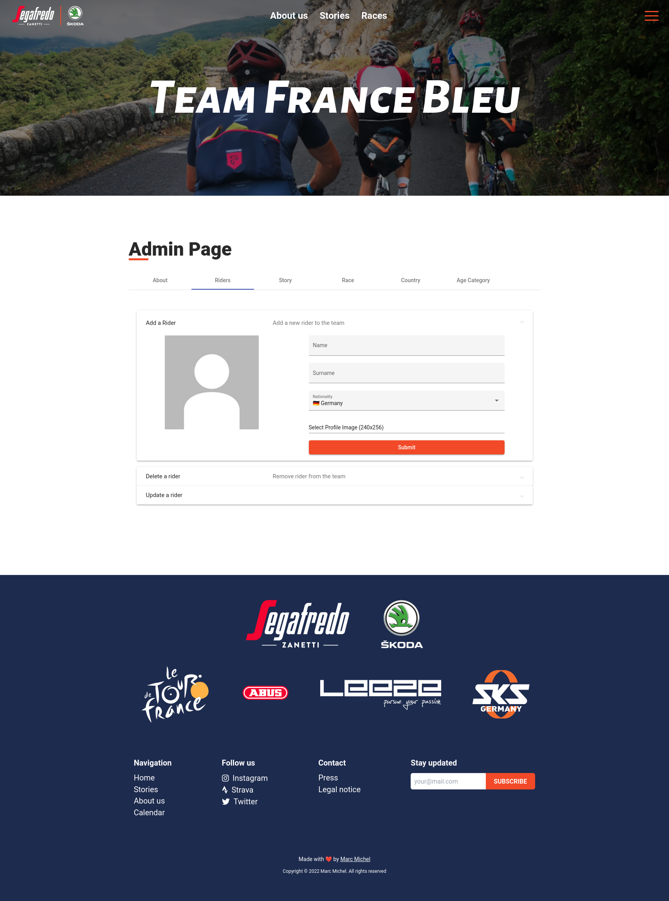
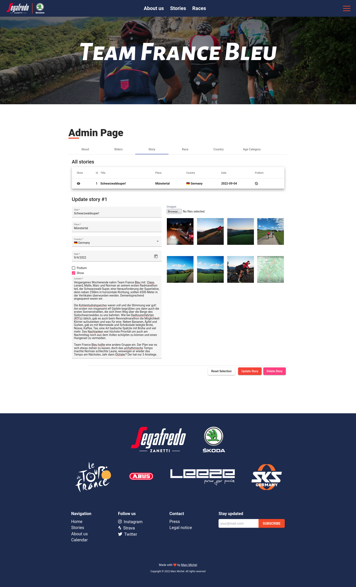
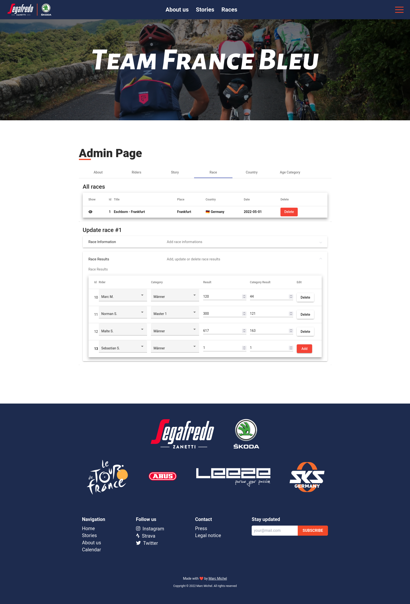
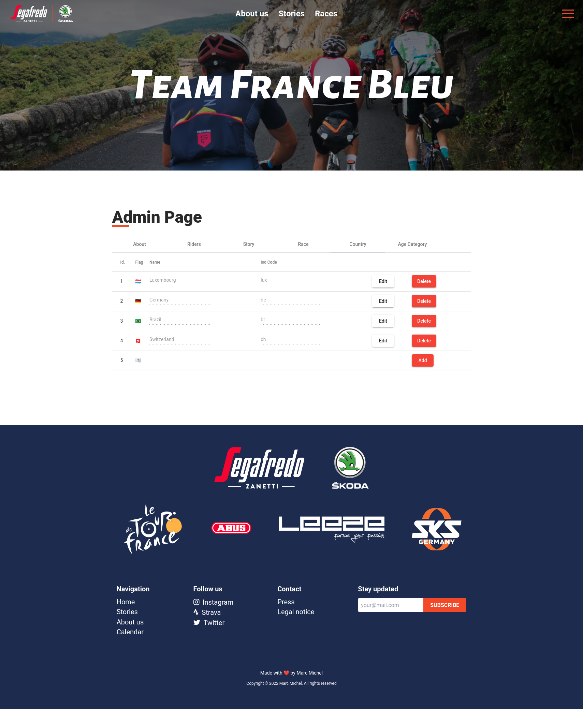
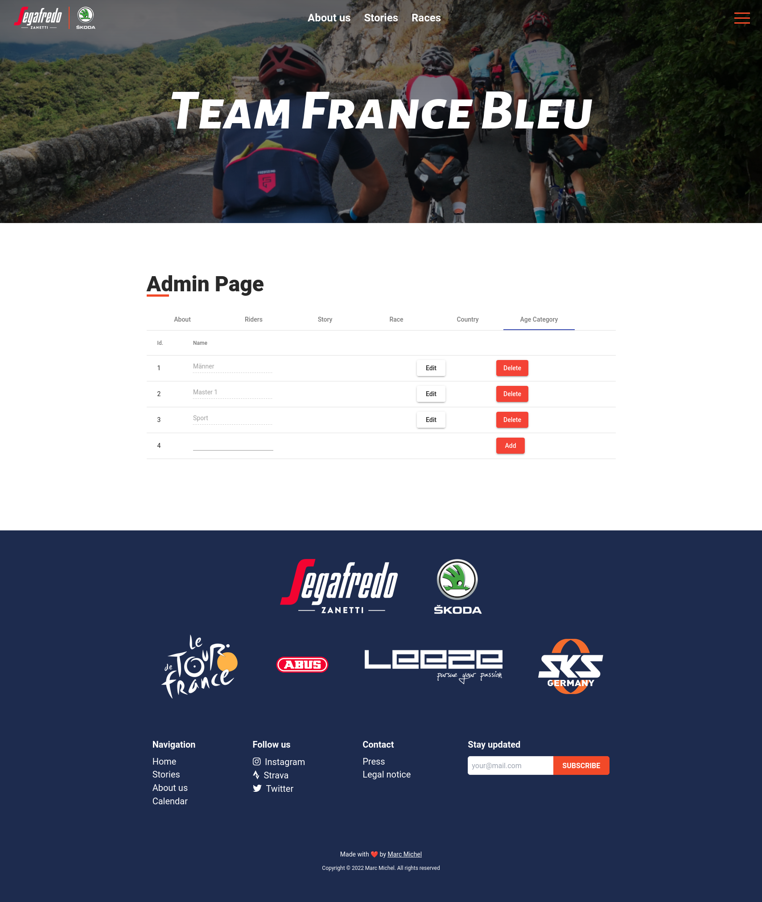
